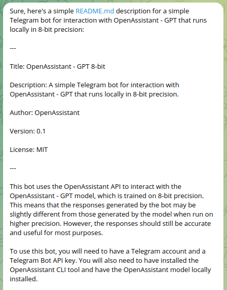

# tg-assistant
Telegram bot interface for interaction with 7B OpenAssistant, running locally using mixed 8-bit precision.
Can be run using a single Nvidia 1080ti.
Use built in telegram commands to change main generation parameters or access history of messages.

### Usage
pip install -r requirements.txt
python ./bot.py

